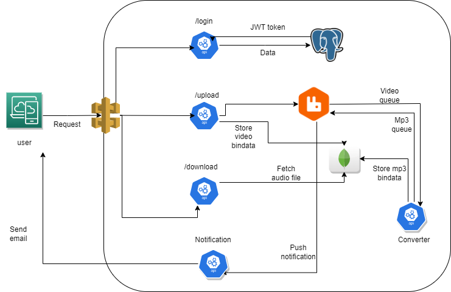

# Microservices Python Application — MP3 Converter

An event-driven microservices application built with Python and deployed on AWS EKS.

Users can upload MP4 video files, which are converted to MP3 audio asynchronously using FFmpeg. Once the conversion is complete, the user receives an email notification with the MP3 file ID (`fid`) for downloading the converted file.

---

## Architecture



---

## Components

### Auth Service

- Flask API
- Connected to PostgreSQL
- Validates user login
- Generates JWT tokens

### Gateway Service

- Handles file uploads
- Stores MP4 files in MongoDB GridFS
- Sends conversion tasks to RabbitMQ
- Provides MP3 download endpoint

### Converter Service

- Runs as a background worker
- Gets conversion tasks from RabbitMQ
- Retrieves MP4 files from GridFS
- Converts MP4 to MP3 using FFmpeg
- Stores MP3 files back in MongoDB

### Notification Service

- Runs as a background worker
- Receives completed conversion messages
- Sends an email containing the MP3 file ID (`fid`)

---

## Setup

### Prerequisites

- AWS account
- AWS EKS cluster
- `kubectl`
- `helm`

---

### 1. Create EKS Cluster

Create an EKS cluster in AWS and configure `kubectl` to connect to the cluster.

> **[SCREENSHOT SLOT — EKS Cluster]**
>
> Add your EKS cluster screenshot here.
>
> `Projectdocs/eks-cluster.png`

---

### 2. Configure Node Inbound Rules

Allow the required ports in the node's Security Group so that the services can be accessed through the Node IP.

For this application, the Gateway and Auth services use NodePorts such as:

```text
30001 → Auth Service
30002 → Gateway Service
```

Add the required inbound rules to the EC2/EKS node Security Group.

> **[SCREENSHOT SLOT — Node Inbound Rules]**
>
> Add your AWS Security Group inbound rules screenshot here.
>
> `Projectdocs/inbound-rules.png`

---

### 3. Deploy Microservices

Deploy the following services:

- Auth Service
- Gateway Service
- Converter Service
- Notification Service

Check the running pods:

```bash
kubectl get pods
```

> **[SCREENSHOT SLOT — Running Pods]**
>
> Add your running microservices pods screenshot here.
>
> `Projectdocs/running-pods.png`

---

### 4. Check Services

Check the Kubernetes services:

```bash
kubectl get services
```

The Auth and Gateway services expose NodePorts that can be accessed using the Node IP.

> **[SCREENSHOT SLOT — Kubernetes Services]**
>
> Add your Kubernetes services screenshot here.
>
> `Projectdocs/services.png`

---

### 5. Login

```bash
curl -X POST http://<NODE_IP>:30001/login \
  -u "user@example.com:password"
```

This returns a JWT token.

---

### 6. Upload MP4

```bash
curl -X POST http://<NODE_IP>:30002/upload \
  -H "Authorization: Bearer <YOUR_JWT_TOKEN>" \
  -F "file=@./assets/video.mp4"
```

The Gateway stores the file in MongoDB and sends a conversion task to RabbitMQ.

> **[SCREENSHOT SLOT — MP4 Upload]**
>
> Add your upload screenshot here.
>
> `Projectdocs/upload.png`

---

### 7. Check RabbitMQ

```bash
kubectl exec -it rabbitmq-0 -- rabbitmqctl list_queues
```

This shows the RabbitMQ queues and helps verify that the conversion task has been received.

> **[SCREENSHOT SLOT — RabbitMQ]**
>
> Add your RabbitMQ screenshot here.
>
> `Projectdocs/rabbitmq.png`

---

### 8. Conversion

The Converter Service gets the task from RabbitMQ, retrieves the MP4 file from MongoDB GridFS, converts it to MP3 using FFmpeg, and stores the MP3 file back in MongoDB.

> **[SCREENSHOT SLOT — Conversion]**
>
> Add your converter service screenshot here.
>
> `Projectdocs/converter.png`

---

### 9. Email Notification

After conversion is complete, the Notification Service sends an email containing the MP3 file ID (`fid`).

> **[SCREENSHOT SLOT — Email Notification]**
>
> Add your email screenshot here.
>
> `Projectdocs/email.png`

---

### 10. Download MP3

Use the `fid` received in the email to download the converted MP3 file.

```bash
curl -o video.mp3 \
  -H "Authorization: Bearer <YOUR_JWT_TOKEN>" \
  "http://<NODE_IP>:30002/download?fid=<MP3_FID_FROM_EMAIL>"
```

> **[SCREENSHOT SLOT — MP3 Download]**
>
> Add your download screenshot here.
>
> `Projectdocs/download.png`

---

